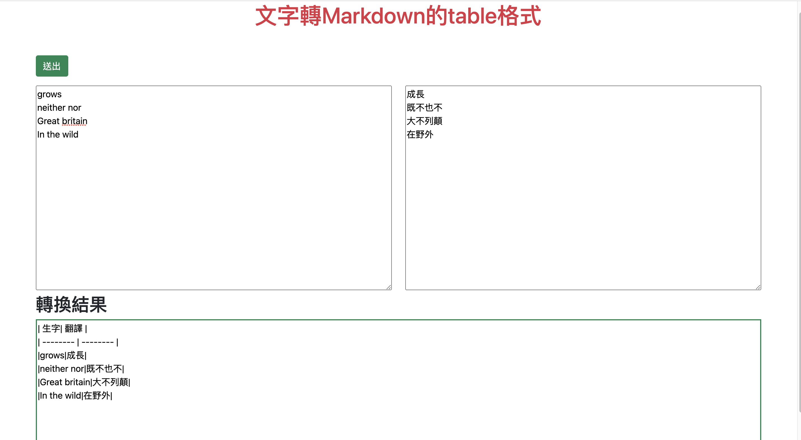
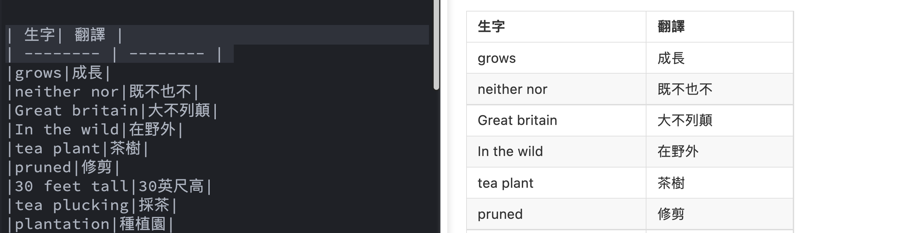

# 將文字轉為markdown的table格式
## [轉換器連結](https://loking23.github.io/textToMarkdownTable/)  
將文字貼上後可以轉換成「markdown」的 table 格式，目前只有做出超簡易版，未來會再優化，像是：
- 新增欄位
- 選擇資料斷點（目前換行才算斷點，可以加上空格斷點等常用斷點選擇）
- 處理使用者輸入空值時的處理
- 可以自行新增標題（沒有則使用預設）
- 新增一鍵複製

## 使用方式
將欲合併成table的文字分別丟進文字方框內，每個換行相當於下一筆資料，將文字貼進去後按下「送出」按鈕，
- 使用畫面

- 丟進markdown畫面
  

